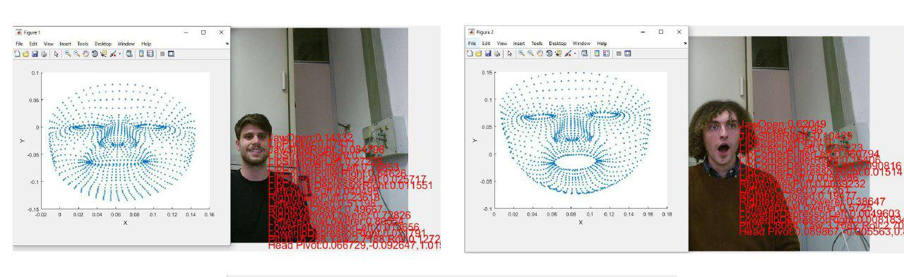
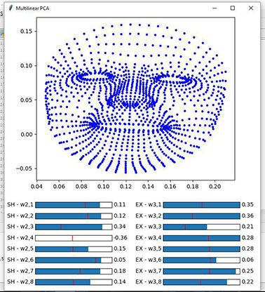

# Shape and action unit extraction of 3D human face meshes by multilinear dimensionality reduction
This work aims to create a model able to discern shape and action units form 3D human face meshes.
The adopted dataset was acquired by using Kinect and consist of 360 3D representation of human faces.
More precisely, 20 different users performed 6 specific facial expressions (happy, sad, fearful, angry, disgusted, surprised) by using 3 emphasis degree (low, medium, high).
The collected dataset was labelled and then modelled in a three-dimensional tensor. Then, a multilinear dimensionality reduction technique (Higher-order singular value decomposition - HOSVD) was applied on purpose.
This process allows to separately extract the face deformation features related to the **shape units** and the **action units**.
These specific features are finally exploited to independently rebuild the user human face by using much fewer data with respect to the starting dataset, maintaining about 90% of variance.


## To Start

### Requirements

The proposed code was written in two different languages:
[Matlab](https://it.mathworks.com/downloads/)  and [python 3.6](https://www.python.org/downloads/).

## Execution

### Kinect-based 3D mash acquisition
All listed files are located in the folder called Matlab/.

Matlab acquisition code is called **AcquireData.m**. Once the computer is connected to the Kinect, run this file and then follow the instructions given by the command line. This software allows representing a 3D face mesh in a structured array, which will be saved in the Dataset \ Struct & folder.
To convert the structured array into a three-dimensional point model execute the file **savePointModel.m** which save its results in a .mat file located in the Dataset \ PointModel / directory. To convert the resulting files in .CSV format, run the file **convertToCsv.m** which create a folder Dataset \Csv containing the reformatted files.
To display 3D meshes saved in files .mat or .cvs execute **LoadData \ mat.m** or **LoadData \ csv.m**, respectively by typing the desired file name in the command line.



### Shape and action units building
All files are located in the Python /.idea/ directory.
The complete code is in the file **Hosvd.py**. It automatically read the files in the Dataset_Csv / directory and exploit them to create the tensor that is provided as input to perform the HOSVD. Whether you wish to change the dimensionality reduction output components number, modify the following portion of the code:


```bash
nn_core, nn_factors = tucker(allTen2, ranks = [4041, 8, 8])

```

Replacing 8 with the number of components desired respectively for identity and expression.
If you want to display a specific reconstructed face using the reduced tensor, select the individual components of shape and action unit as shown in the following example:

```bash
    coeffSh =  np.array(mode2[17, :])[np.newaxis] # user 18
    coeffEx =  np.array(mode3[2, :])[np.newaxis] # happy face 

```

Outputs will be saved in the file Face1.csv that can be viewed in Matlab by following the same instructions given in the previous section.


### Graphic interface
Graphic interface files are located in the Python / .idea / directory.
Run file **HosvdGUI.py** to open the interface that allows changing the shape and action units parameters independently.




## Authors

* **Riccardo Presotto**  -  riccardo.presotto@unimi.it
* **Davide Coluzzi**  - davide.coluzzi@unimi.it
